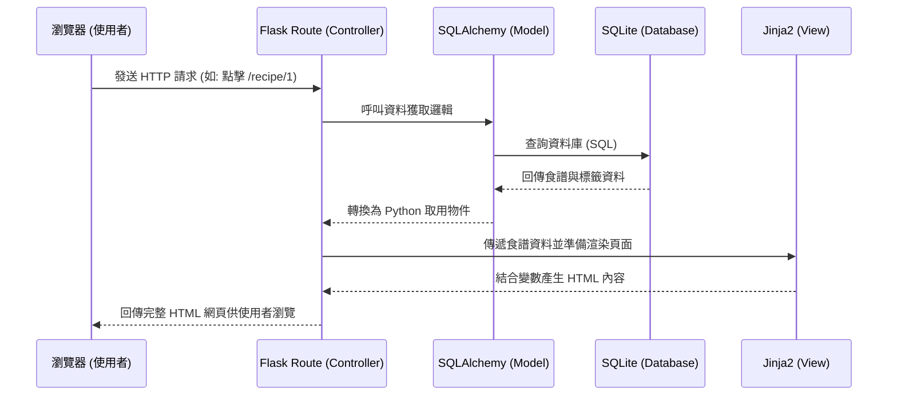

# 系統架構設計 (Architecture) - 食譜收藏夾系統

本文件基於 `docs/PRD.md` 的功能需求，規劃食譜收藏夾系統的技術架構與資料夾結構。

## 1. 技術架構說明

為了快速開發且滿足 PRD 中的需求，本專案採用輕量級的 Python Web 框架 Flask，搭配 Jinja2 模板引擎與 SQLite 資料庫。這樣能將應用程式所需的所有功能集中於一處，無須過度分離前後端，適合目前預期的小型系統架構。

- **選用技術與原因**：
  - **後端框架：Python + Flask**。Flask 輕便且彈性高，適合用來快速打造個人收藏夾系統的 RESTful API 與頁面路由。
  - **模板引擎：Jinja2**。與 Flask 原生整合，可以在後端直接處理好資料再送到前端進行 HTML 渲染，降低前端介面開發的門檻。
  - **資料庫：SQLite (搭配 SQLAlchemy ORM)**。只需單一實體檔案儲存資料，不需額外架設資料庫伺服器，對個人專案負擔最小，且未來轉移方便。

- **Flask MVC 模式說明**：
  - **Model (資料模型)**：負責定義食譜（Recipes）、分類（Categories）與標籤（Tags）的資料庫表結構，並處理與 SQLite 之間的讀寫。
  - **View (視圖)**：負責前端呈現，由 Jinja2 接收從後端傳遞來的變數（如食譜清單、單個食譜內容），渲染成最終的 HTML 網頁。
  - **Controller (控制器)**：由 Flask Route 擔任。接收使用者的操作（例如：點擊搜尋、新增食譜表單送出），向 Model 獲取或更新對應資料後，將結果拋給合適的 View 去顯示。

## 2. 專案資料夾結構

建議的檔案與資料夾結構如下：

```text
web_app_development/
├── app/
│   ├── __init__.py      ← 負責初始化 Flask 與載入套件
│   ├── models/          ← 對應資料庫表的模型定義 (DB Schema)
│   │   └── recipe.py    ← 定義食譜、分類、標籤的 Model
│   ├── routes/          ← Flask 路由控制器 (主要邏輯)
│   │   ├── main.py      ← 首頁進入點與搜尋相關路由
│   │   └── recipe.py    ← 食譜的新增、修改、刪除、檢視路由
│   ├── templates/       ← Jinja2 HTML 模板
│   │   ├── base.html    ← 網頁共用版型 (導覽列、頁尾)
│   │   ├── index.html   ← 首頁 (食譜清單與搜尋結果)
│   │   ├── detail.html  ← 單一食譜詳細閱讀頁
│   │   └── form.html    ← 新增或編輯食譜的表單頁
│   └── static/          ← 靜態資源檔案
│       ├── css/
│       │   └── style.css
│       ├── js/
│       │   └── main.js
│       └── images/      ← 存放使用者上傳或預設之圖片
├── instance/
│   └── database.db      ← SQLite 資料庫檔案本體 (不進入版本控制)
├── docs/                ← 文件存放區 (PRD, Architecture 等)
├── app.py               ← 專案進入點，用來啟動 Flask 伺服器
├── requirements.txt     ← 專案 Python 套件依賴清單
└── README.md            ← 專案說明文件
```

## 3. 元件關係圖

系統運作時，前端瀏覽器、Flask 與資料庫的互動流程如下：



## 4. 關鍵設計決策

1. **採用 Server-Side Rendering (SSR)**
   - **原因**：根據 PRD 不要求前後端分離，使用 Flask + Jinja2 回傳完整 HTML 能加速開發，並且 SEO 友善，也很容易處理資料送出和驗證的邏輯。
2. **SQLite 作為主要資料庫**
   - **原因**：為「食譜收藏」這種輕量且讀取大於寫入的資料特性，沒有必要架設 PostgreSQL 或 MySQL。而且一個 `.db` 檔即可完成打包部署。
3. **路由結構拆分**
   - **原因**：把「頁面瀏覽 / 搜尋 (main.py)」與「食譜管理流程 CRUD (recipe.py)」分開，避免所有路由都擠在一個檔案增加維護難度。
4. **準備引入 SQLAlchemy ORM**
   - **原因**：相較於手寫 SQL 語句，ORM 在安全上能大幅降低 SQL Injection 的可能，且未來在處理「多篇食譜隸屬於同一標籤」的多對多關聯時具有極大的抽象與方便性。
