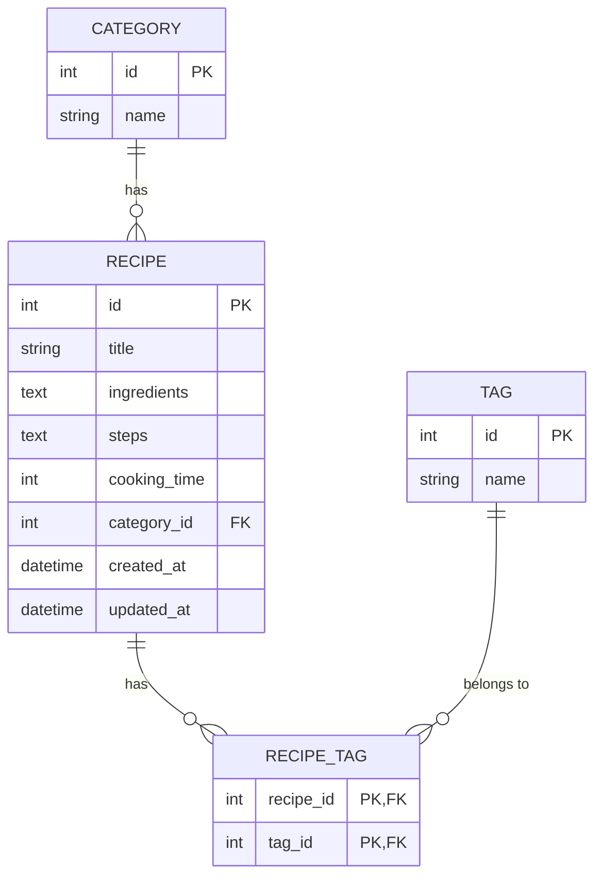

# 資料庫設計 (DB Design) - 食譜收藏夾系統

本文件根據 `docs/PRD.md` 與 `docs/FLOWCHART.md` 中定義的食譜、分類與標籤等需求，設計 SQLite 的資料表結構與關聯，並使用 SQLAlchemy 進行後續的程式碼實作。

## 1. ER 圖（實體關係圖）

## 2. 資料表詳細說明

### 2.1 categories（分類表）
用來存放料理分類，如「早餐」、「甜點」、「日式料理」。
- `id` (INTEGER, PK): 唯一識別碼，自動遞增。
- `name` (VARCHAR, 必填): 分類名稱，具有 UNIQUE 限制以避免重複。

### 2.2 tags（標籤表）
用來存放食譜屬性的獨立標籤，如「低卡」、「快速」、「微波爐」。
- `id` (INTEGER, PK): 唯一識別碼，自動遞增。
- `name` (VARCHAR, 必填): 標籤名稱，具有 UNIQUE 限制以避免重複。

### 2.3 recipes（食譜主表）
系統主要核心，儲存食譜的內容資訊。
- `id` (INTEGER, PK): 唯一識別碼，自動遞增。
- `title` (VARCHAR, 必填): 食譜標題。
- `ingredients` (TEXT, 必填): 所需食材清單與相對應的份量（以純文字儲存並供前端分行顯示）。
- `steps` (TEXT, 必填): 料理的詳細步驟。
- `cooking_time` (INTEGER, 選填): 料理所需時間（單位：分鐘）。
- `category_id` (INTEGER, 必填): 關聯至 `categories.id`，代表所屬的分類 (Foreign Key)。
- `created_at` (DATETIME, 必填): 建立時間，預設為當下時間。
- `updated_at` (DATETIME, 必填): 更新時間，每次更新時會自動修改為當下。

### 2.4 recipe_tags（食譜與標籤關聯表）
紀錄食譜與標籤之間的多對多 (Many-to-Many) 關係，方便後續透過標籤進行多重篩選。
- `recipe_id` (INTEGER, PK, FK): 關聯至 `recipes.id`，且在刪除食譜時會一併被 CASCADE 刪除。
- `tag_id` (INTEGER, PK, FK): 關聯至 `tags.id`。

## 3. SQL 建表語法
已儲存於 `database/schema.sql`，可提供不使用 ORM 時的初始化參考。

## 4. Python Model 程式碼
依據本設計所開發的 SQLAlchemy Models 已儲存在 `app/models/recipe.py` 中，包含關聯之定義與常用的 CRUD 方法。
