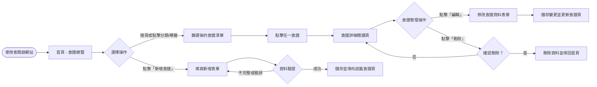
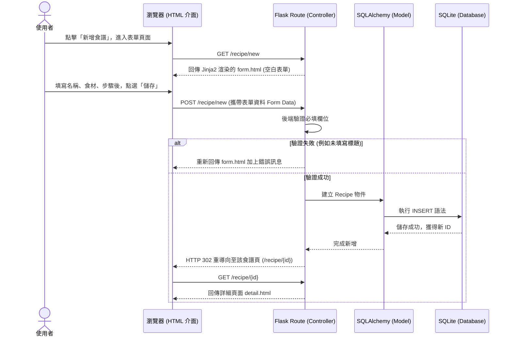

# 流程圖設計 (Flowchart) - 食譜收藏夾系統

本文件基於 `docs/PRD.md` 需求與 `docs/ARCHITECTURE.md` 系統架構，繪製食譜收藏夾系統的使用者流程圖與系統序列圖。

## 1. 使用者流程圖 (User Flow)

描述使用者進入系統後，可以進行的各項主要操作路徑。

## 2. 系統序列圖 (Sequence Diagram)

以「新增一筆食譜」為例，展示前端瀏覽器、後端介接 (Flask Controller) 以及資料庫間的互動與資料流動。

## 3. 功能清單對照表

彙集上述流程中，後端 API 路由與各個功能對應的 HTTP 方法。

| 模組 | HTTP 方法 | URL 路徑 | 功能說明 |
| :--- | :--- | :--- | :--- |
| **主畫面** | GET | `/` | 進入系統首頁，顯示全部食譜清單與分類快篩 |
| **瀏覽與搜尋** | GET | `/search` | 根據條件（關鍵字、標籤、時間）回傳篩選結果 |
| **食譜檢視** | GET | `/recipe/<int:id>` | 呈現單一食譜的詳細圖文、食材及步驟 |
| **新增食譜** | GET | `/recipe/new` | 回傳新增食譜用的空白表單頁面 |
| **新增食譜** | POST | `/recipe/new` | 接收表單並將新食譜寫入資料庫 |
| **編輯食譜** | GET | `/recipe/<int:id>/edit` | 回傳帶有舊有資料的編輯表單頁面 |
| **編輯食譜** | POST | `/recipe/<int:id>/edit` | 接收編輯後的表單並覆蓋資料庫原有紀錄 |
| **刪除食譜** | POST | `/recipe/<int:id>/delete`| 將特定 ID 的食譜從資料庫移除，後重導至首頁 |
